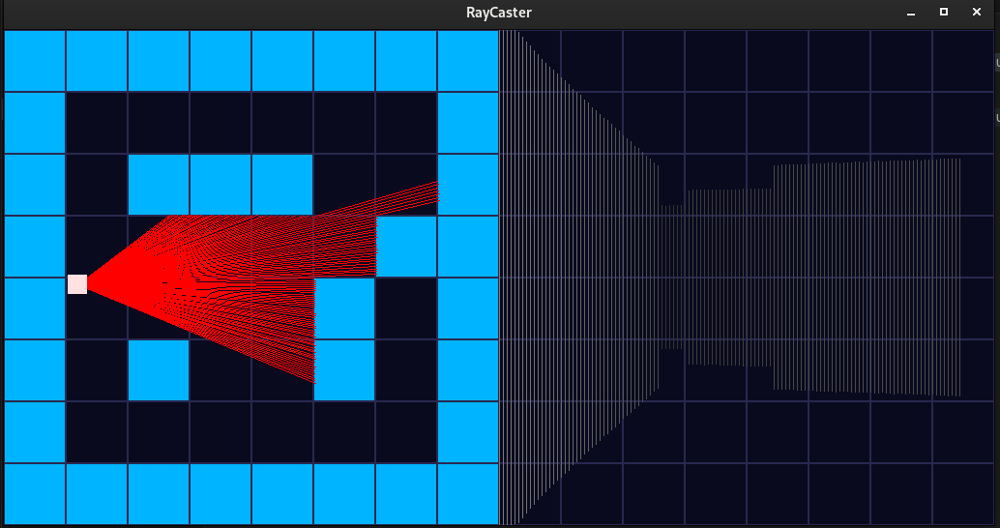
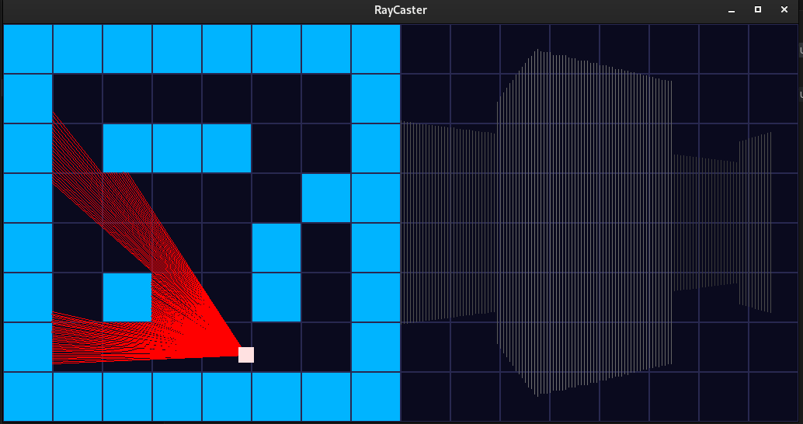

# 🎯 Traditional SDL Ray Caster

A low-level, traditional ray casting engine built in **C++** using **SDL3**. This project is a homage to the early days of 3D rendering, showcasing the principles behind games like *Wolfenstein 3D* and *DOOM*. It renders a pseudo-3D environment using efficient 2D mathematics and a handcrafted graphics pipeline.

---

## 🧩 Features

- 🧠 Ray casting engine implemented from scratch  
- 🎮 Real-time rendering with **SDL3**  
- 🧱 2D grid-based level system  
- 🛠️ Lightweight and modular C++ code  
- 🧭 Keyboard-based navigation and interaction  
- 💡 Designed for learning graphics fundamentals  

---

## 🚀 Getting Started

### 🧰 Prerequisites

## 🚀 Installation

Run the following commands:

```bash
sudo apt update
sudo apt install libsdl3-dev
make
./raycaster


```
# 🧱 Build & Run :
 1. Clone the repository:

  ```bash
    git clone https://github.com/Akshat-singh90056/Traditional-SDL_Ray-Caster.git
    cd Traditional-SDL_Ray-Caster


```
  2. Compile the project:

     ```bash
     make

     ```

  3. Run the raycaster:

     ```bash

     ./raycaster

     ```

  # 🗂️ Project Structure

   ```bash

  Traditional-SDL_Ray-Caster/
├── main.cpp           # Entry point and main SDL loop
├── tracer.cpp/.h      # Ray casting engine and rendering logic
├── map.c/.h           # 2D map grid layout and wall detection
├── makefile           # Build automation
└── .vscode/           # Optional editor config (for VS Code)

```
## 🎮 Controls :

   1. W & S Keys – Move forward/backward 
   2. Mouse courser - to give direction to the ray

# 🔍 Understanding Ray Casting:

 Ray casting simulates a 3D environment using 2D mathematics:

  1. Cast rays from the player’s viewpoint at varying angles

  2. Detect wall collisions in a grid

  3. Measure distances to intersections

  4. Draw scaled vertical slices to simulate depth

  5. It was the backbone of early FPS engines and remains a powerful educational tool.


## 🖼️ Screenshot

Here’s a live snapshot of the ray casting engine in action:






- Left: Top-down 2D view with rays (in red) projected into the grid
- Right: Projected pseudo-3D perspective using wall slice rendering


